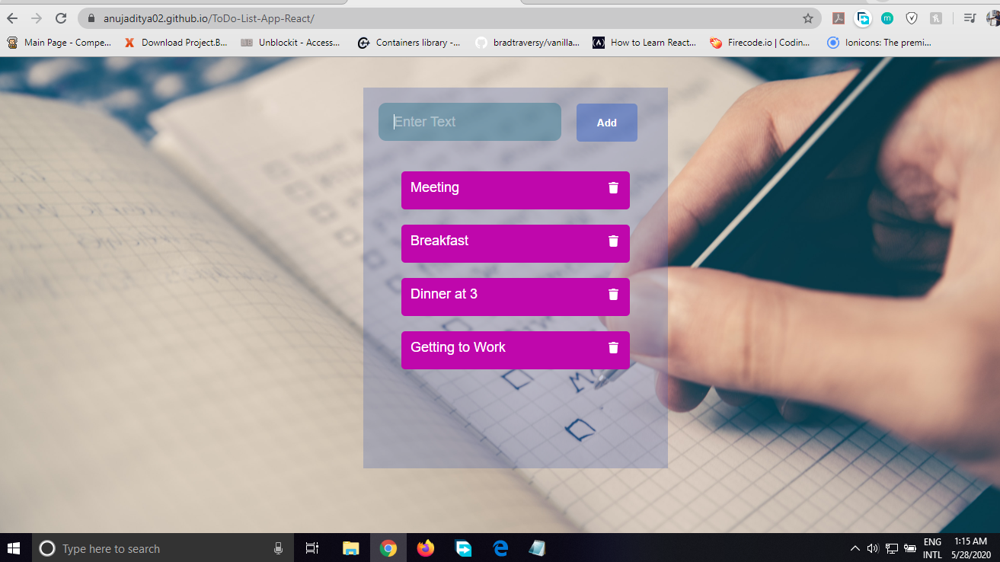

<h1> To-Do List </h1>

Created using ReactJs. In, this To-Do List we can do the basic task like:

<ol>
  <li>Add Item</li>
  <li>Delete Item</li>
  <li>Delete Item </li>
</ol>

<a href="https://anujaditya02.github.io/ToDo-List-App-React/">To-Do List App </a>

<h2>ScreenShot</h2>

 
